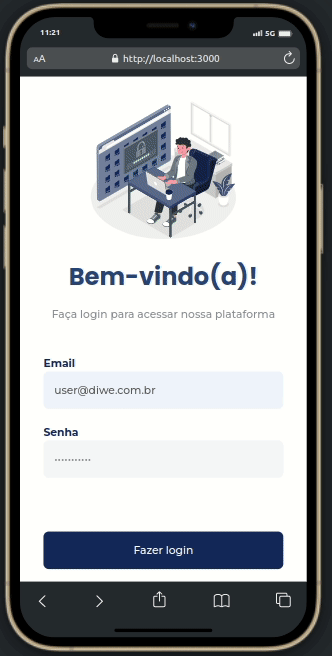
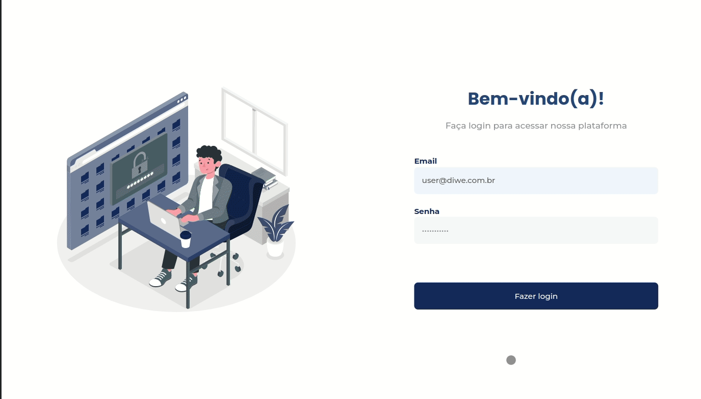

# Contexto

Desafio técnico proposto pela empresa [DIWE](https://diwe.com.br/). 
Foi desenvolvido uma aplicação web para gerenciamento de uma lista de contatos
podendo o usuário: listar, criar, editar e deletar contatos. Layout foi feito de
acordo com o figma disponibilizado e totalmente responsivo.


## Deploy da aplicação

https://contact-book-orpin.vercel.app/

## Técnologias usadas

- React
- Javascript
- SASS/SCSS
- Axios
- React-testing-library
- jest

## Dados de acesso

- Para acessar a aplicação basta utilizar os dados abaixo no login:

```
{
  "email": "user@diwe.com.br",
  "password": "Mob20we23##"
}
```

## Acessando o código e executando a aplicação

- Clone o repositório

```
git clone git@github.com:ArthurSimoess/desafio-diwe.git
```

- Entre na pasta do repositório que você acabou de clonar:

```
cd desafio-diwe

```

- Instale as dependências e inicialize o projeto

```
npm install
```
```
npm start
```

## Executando Testes

- Para rodar todos os testes:

```
npm test
```

## Aplicação

<p>
   
</p>

<p>
   
</p>
